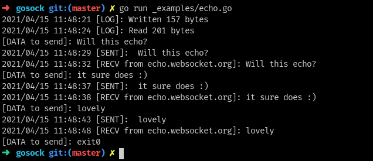

# Gosock

Implementation of the websocket protocol.

# Supports
- [x] Opening Handshake
- [x] Closing handshake
- [x] Send data (up to 125 bytes)
- [ ] Ping
- [ ] TLS 

# Examples

The repo comes with a echo example.

## Usage:

```go
git clone https://github.com/segfult/gosock
cd gosock/
go run _examples/echo.go
```



# References
- https://tools.ietf.org/html/rfc6455
